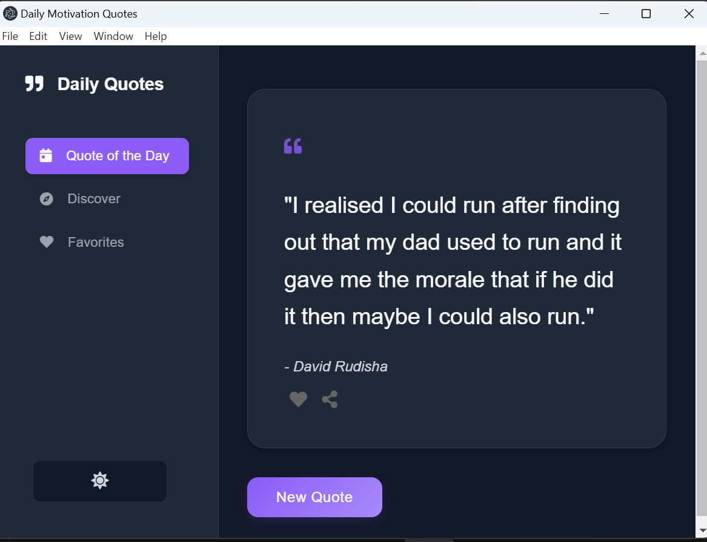
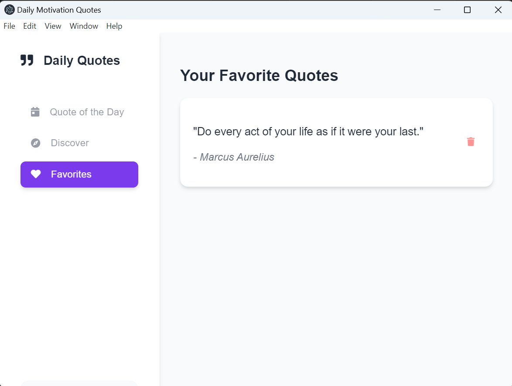

# Daily Quotes App 🌟

> A sleek Electron-based desktop application for daily inspiration.

<div align="center">
  
</div>

## ✨ Features

- 🎯 Daily motivational quotes
- 🔍 Discover quotes by category
- ❤️ Save favorite quotes
- 🌓 Dark/Light mode toggle
- 📱 Responsive design
- 🔄 Share quotes

## 📸 Screenshots

<div align="center">
  
  <br/><br/>
  <div style="display: flex; justify-content: space-between;">
    
  </div>
</div>

## 🚀 Installation

```bash
# Clone the repository
git clone https://github.com/Ehabejoel

# Navigate to directory
cd daily-quotes

# Install dependencies
npm install

# Start the app
npm start
```

## 🛠️ Technologies

- Electron
- JavaScript
- HTML/CSS
- Quotes API (api-ninjas.com)

## 💻 Development

```bash
# Run in development mode
npm start

# Build the app
npm run make
```

## 📄 License

MIT
